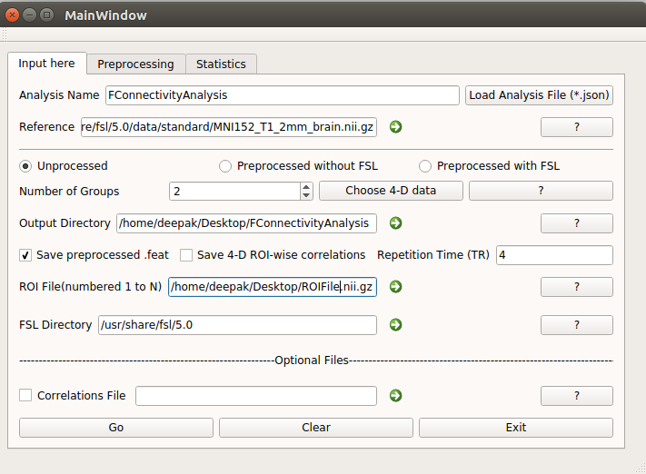

# Functional Connectivity GUI & Statistics Calculation

## ABOUT
This directory contains the graphical user interface for the toolkit on **Region of Interest based Functional Connectivity Analysis**. The main window looks like this.

For more information about the fields in the main window, please look into [this file](docs/MainWindow.md).

## GUI Architecture

* Made in **Qt Creator**
* Option for Registration of the data is also available if already not registered to the reference image. It used FLIRT for the registration.
* FSL is must for the working of the GUI.
* Accepts the groups upto 5 for now. The statistical analysis for ROI correlation maps has been implemented only for the various combinations of comparison between groups.
* An ROI atlas needs to be supplied where each voxel is labeled from 1 to N where N is total number of ROIs. The voxels outside the brain should be numbered 0.
* Statistical analysis within a group is also allowed. It is assumed that the mean correlation for the population is 0 as the Null Hypothesis. 
* FDR Correction has also been implemented. If you want, you can also check Fisher Transformation for further normalization of the data.
* The statistical tests currently available are:
    * Simple 1 sample Student&rsquo;s t-test
    * 2 sample t-test

## Preprocessing of fMRI data
A user can also preprocess the data if he wants. All the preprocessing methods have been explained in detail [here](docs/Preprocessing.md).

## Registration and Correlations
In order to read more about it, please see [this file](docs/RegCorr.md).

## Statistics
This window allows for making changes in the statistical analysis. Please see the [following file](docs/stats.md).