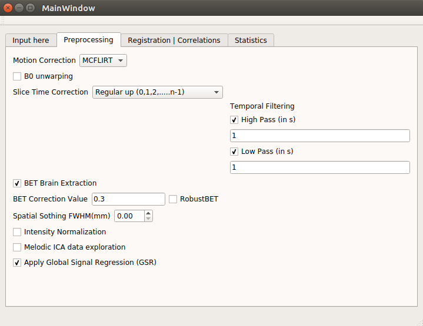

# Preprocessing of data
A user can also preprocess the data if he wants. All the preprocessing methods have been implemented using [NiPype](http://miykael.github.io/nipype-beginner-s-guide/installation.html): a pipeline for neuroimaging analysis. Nipype creates parallel workflows for preprocessing and finding ROI based correlation in different subjects. The GUI interface is shown below:

The GUI contains the basic preprocessing pipeline with the methods written below:

* **Slice Time Correction**: 
Ascending, Descending or Interleaved order. You can also provide a Slice Time Correction file in the same format as that of FSL. 

* **Motion Correction**: This option corrects the motion of the brain during the scan and calls FSL&rsquo;s MCFLIRT command at the backend.
* **BET Brain Extraction**: This option extracts the brain from the skull and the threshold for brain extraction can be varied from 0 to 1. It also contains the options for doing robust brain extraction. 
* **Spatial Smoothing using SUSAN**: It uses the SUSAN method for spatial smoothing, the same way as implemented in FSL. The value can be varied in mm.
* **Temporal Filtering**: It has options for doing both high pass as well as low pass filtering. The user can also try to do band-pass. The value in GUI is put in seconds while in the json, the value is in units of sigma.
* **Intensity Normalization**: It has the same intensity normalization function as used in FSL. 
