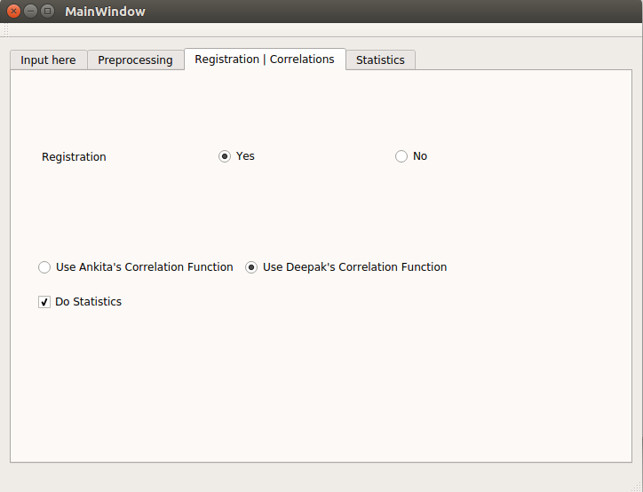

# Registration and Correlations

Here&rsquo;s the interface for doing registration and correlation.

Check the appropriate button accordingly if you want to do registration or not. In case the preprocessing is done already using FSL, another option for applying global signal regression (GSR) also appears in the window. 

There are two ways for doing correlation:
* **Using MKL**: It requires Intel-MKL pre-installed in the PC. CuBLAS can help further increase the speed and overall performance. 
* **Using Nipype Workers**: It works by processing multiple brains at a time and finding correlations for each. The multi-threading is handled by Nipype.

You can choose any of these two for finding the correlations.

In case you also want to do statistical analysis, please put a tick mark on **Do Statistics**.