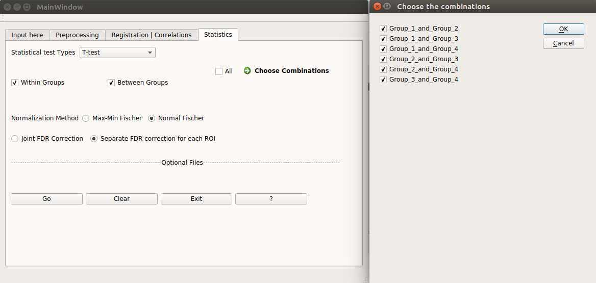

# Statistics

The stats window looks like this

Currently, a user can perform a simple one sampled or two sample Student&rsquo;s t-test. By selecting,

* **Within Groups**, one can perform a one sampled t-test with the group mean 0 and the population standard deviation estimated according to the number of subjects.
* **Between Groups**, one can perform a two-sampled t-test with either of the two alternate hypothesis, **G1>G2** or **G2>G1**. Another option to choose the combination of groups for comparison is also available here. 

The normalization method currently available is Fisher method introduced by Ronald Fisher.

Also, a user can choose whether to perform all the hypothesis tests together or treat the N region of interest (ROI) maps independently, where N is number of ROIs. Most of the times, the first method makes most of the corrected maps insignificant resulting in wrong results. If a large number of data samples are available, then it can be used for the analysis.